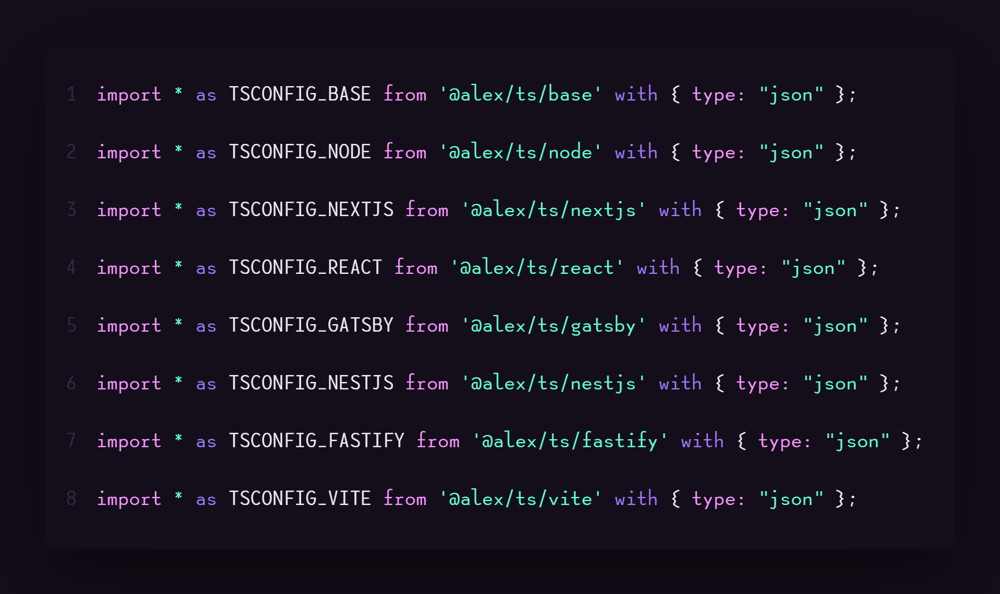
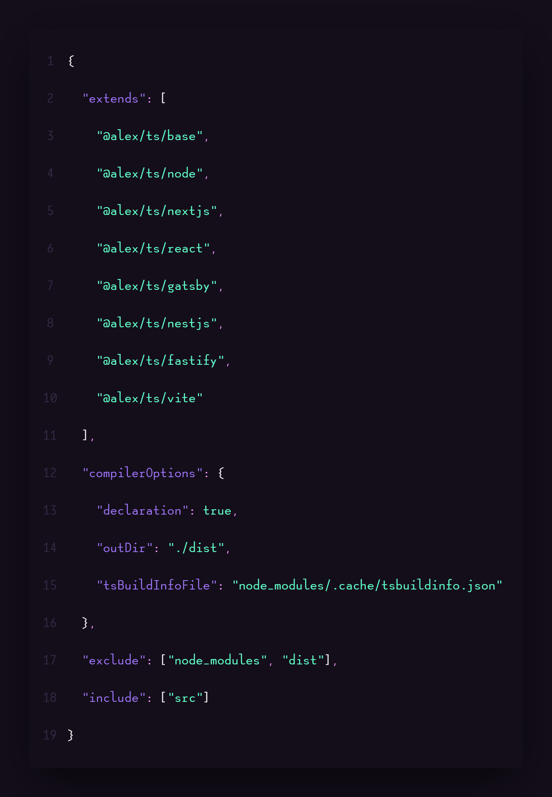
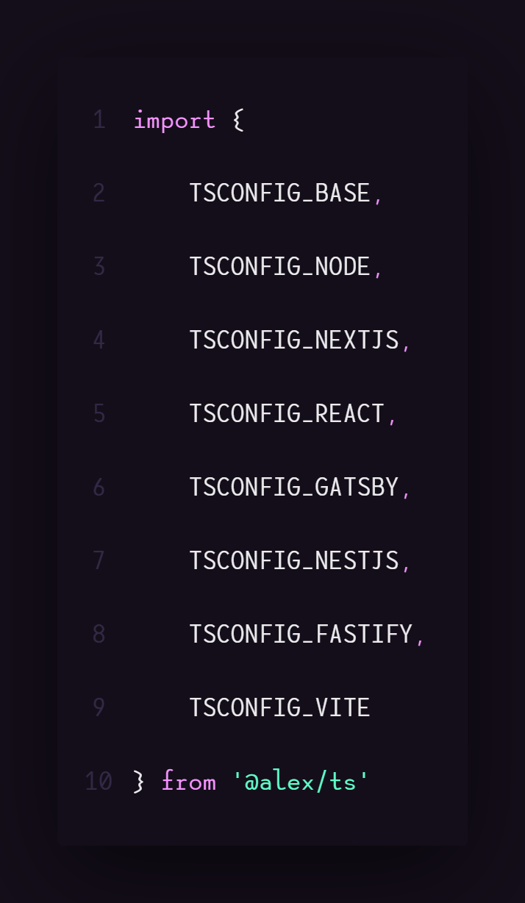
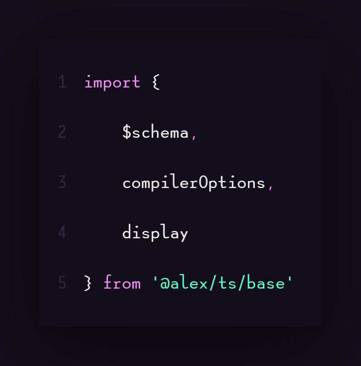

<div style="display: flex; align-items: center; justify-content: start; gap: 20px; padding: 10px 0;">
  
  <h1 style="margin: 0;">Typescript configs</h1>
</div>

> **@alex/ts** - Набор общих конфигураций TypeScript для различных проектов.

Этот пакет предоставляет преднастроенные файлы конфигурации TypeScript для популярных инструментов и фреймворков, таких
как **Next.js**, **React**, **Gatsby**, **NestJS** и другие. Используйте эти настройки для стандартизации и ускорения
настройки новых проектов. Этот пакет помогает вам избежать повторной настройки и ошибок при работе с TypeScript.

## Возможности

- Конфигурации для популярных фреймворков и библиотек.
- Поддержка последней версии TypeScript.
- Простота в использовании и настройке.

## Установка

Установите пакет с помощью `npm`, `yarn` или `pnpm`:

## NPM

```bash
npm install -D @alex/ts
```

## PNPM

```bash
pnpm add -D @alex/ts
```

## Yarn

```bash
yarn add -D @alex/ts
```

## Importing JSON Files in TypeScript



```javascript
import * as TSCONFIG_BASE from '@alex/ts/base' with { type: 'json' };
import * as TSCONFIG_NODE from '@alex/ts/node' with { type: 'json' };
import * as TSCONFIG_NEXTJS from '@alex/ts/nextjs' with { type: 'json' };
import * as TSCONFIG_REACT from '@alex/ts/react' with { type: 'json' };
import * as TSCONFIG_GATSBY from '@alex/ts/gatsby' with { type: 'json' };
import * as TSCONFIG_NESTJS from '@alex/ts/nestjs' with { type: 'json' };
import * as TSCONFIG_FASTIFY from '@alex/ts/fastify' with { type: 'json' };
import * as TSCONFIG_VITE from '@alex/ts/vite' with { type: 'json' };
```

## tsconfig.json



```json
{
    "extends": "@alex/ts/base",
    "compilerOptions": {
        "declaration": true,
        "outDir": "./dist",
        "tsBuildInfoFile": "node_modules/.cache/tsbuildinfo.json"
    },
    "exclude": ["node_modules", "dist"],
    "include": ["src"]
}
```

## Other API



